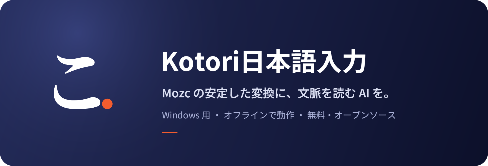
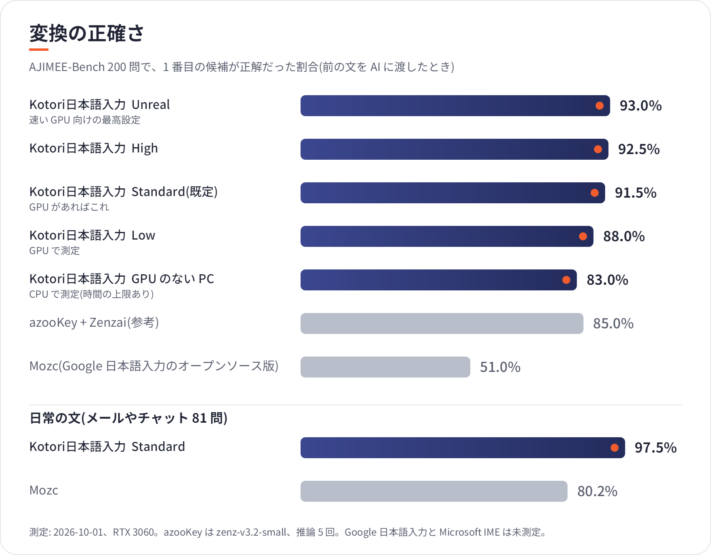
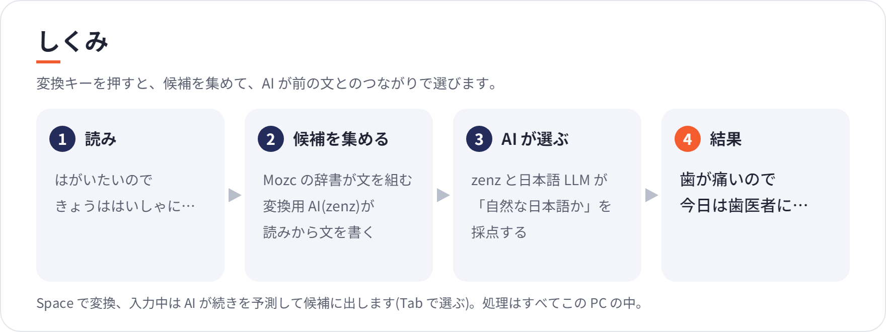

  

  <a href="https://github.com/aruiki/Kotori/releases/latest"><b>ダウンロード(Windows 用 MSI)</b></a>
  ・ <a href="#必要な環境">必要な環境</a>
  ・ <a href="#しくみ">しくみ</a>
  ・ <a href="#よくある質問">よくある質問</a>

**Kotori日本語入力**は、Windows 用の日本語入力(IME)です。Google 日本語入力のオープンソース版である
**Mozc** の変換エンジンと辞書をそのまま土台にし、その上で **AI が前後の文脈を読んで候補を選び直します**。
使い慣れた Mozc の操作はそのままに、同音異義語や言い回しの取り違えを減らします。

- **正確**: 変換のベンチマーク AJIMEE-Bench で第 1 候補の正解率 **91.5%**(既定の Standard)。Mozc 単体は 51.0%。
  メールやチャットのような日常の文 81 問では Mozc 単体 80.2% → **97.5%**。
- **先回り**: 入力中に AI が文の続きを予測し、候補に出します。「よろし」と打つと「よろしくお願いします」。
- **速い**: 1 打鍵の応答は 1〜3 ms。変換(Space)は 0.07 秒前後(RTX 3060、Standard)。
- **安心**: 処理はすべてこの PC の中で行い、インターネットに接続しません。入力した文字を外に送りません。
- **手軽**: MSI を 1 つ実行するだけ。AI のモデルと GPU の実行環境も同梱し、CUDA などの追加の準備は要りません。

## 変換の例

実際の出力です(Standard、2026-09-30)。「前の文」は、直前に確定した文として AI に渡したものです。

| 読み | 前の文 | Mozc 単体 | Kotori日本語入力 |
| --- | --- | --- | --- |
| はがいたいのできょうははいしゃにいこうかな | | 葉が痛いので今日は医者に行こうかな | **歯**が痛いので今日歯医者に行こうかな |
| おなかがいたいのできょうははいしゃにいこうかな | | お腹が痛いので今日は医者に行こうかな | **お腹**が痛いので今日は医者に行こうかな |
| はしのはしをはしでつまむ | | 橋の橋を橋でつまむ | **箸の箸を箸**でつまむ |
| いしをつたえる | 自分の | 医師を伝える | **意思**を伝える |
| ここではきものをぬいでください | 玄関で靴を脱いで。 | ここでは着物を脱いでください | **ここで履物**を脱いでください |

## 変換の正確さ

- [AJIMEE-Bench](https://github.com/azooKey/AJIMEE-Bench) は、かな漢字変換の難しい 200 問(同音異義語、文脈で
  決まる語など)の評価セットです。1 番目の候補が正解と一致した割合を数えています。
- 測り方と記録はすべて [eval/README.md](eval/README.md) にあります。Google 日本語入力(製品版)と
  Microsoft IME は自動で測る方法がないため、まだ比べていません。

## 入力中の AI 予測

入力している間、AI が文の続きを裏で考え、次の打鍵のときに候補の先頭に「AI」と付けて出します。
Tab で予測の候補に移って選べます。決まった言い回し 29 問で、正しい続きが上位 3 件に出た割合は
Mozc 単体 17.2% → **58.6%** です。予測は打鍵を待たせません(1 打鍵の応答 1〜3 ms)。
手を止めてから Tab を押すと、裏で作っておいた予測が約 0.04 秒で出ます。

## しくみ

1. **候補を集める**: Mozc が辞書から文を組み立て、変換用の小さな AI(zenz)も読みから文を書きます。
2. **AI が選ぶ**: zenz と日本語の言語モデル(TinySwallow-1.5B)が、「前の文に続けて自然な日本語か」を
   それぞれ点数にします。点数の合計がいちばん高い文を選び、文節の区切りもそれに合わせます。
3. **辞書で確かめる**: AI が書いた文は、読みと合っているかを Mozc の辞書で確かめ、合わないものは捨てます。
   AI が読みにない語を足したり、読みを落としたりすることはありません。

AI が働くのは変換(Space)と予測のときだけで、1 文字ずつの入力はこれまでどおり Mozc が処理します。
詳しい設計は [docs/adr/](docs/adr/) にあります(0012 以降)。

## 必要な環境

| | 最低限 | おすすめ |
| --- | --- | --- |
| OS | Windows 10 1809 以降(64 bit) | Windows 11 |
| GPU | なくても動く(品質 Low) | Vulkan 対応の GPU、VRAM 2 GB 以上(NVIDIA / AMD / Intel) |
| メモリ | 8 GB | 16 GB |
| ディスク | 1.3 GB | |

GPU は自動で見つけて使います。ドライバー以外の準備は要りません。動作を確かめた GPU は RTX 3060 です。

### 品質の段階

設定の「AI変換」タブで選べます。数値は RTX 3060 で測りました。

| 品質 | AJIMEE-Bench | 変換 1 回(中央値) | VRAM | 向いている環境 |
| --- | ---: | ---: | ---: | --- |
| Low | 86.5% | 0.03 秒 | - | GPU なし、ノート PC |
| **Standard(既定)** | **91.5%** | **0.07 秒** | 約 1.6 GB | GPU あり |
| High | 92.5% | 0.09 秒 | Standard と同じモデル | 速い GPU |
| Unreal | - | - | - | 大きなモデルを自分で置いたとき |

## インストール

1. [Releases](https://github.com/aruiki/Kotori/releases/latest) から `Kotori64.msi` をダウンロードして実行します。
2. インストールすると、入力方式に **Kotori日本語入力** が加わります。タスクバーの入力方式のアイコン
   (または Windows キー + Space)で切り替えます。
3. 設定はデスクトップの「Kotori日本語入力の設定」から開けます。

アンインストールは「設定」→「アプリ」から行えます。

## よくある質問

**インターネットにつながりますか?** つながりません。辞書も AI も PC の中にあり、入力した文字を外に送りません。

**Google 日本語入力や Mozc と何が違いますか?** 操作と辞書は Mozc と同じです。その上で、変換の最後に
AI が文脈を見て候補を選び直し、入力中に文の続きを予測します。Kotori日本語入力は Google が提供・推奨する
ものではありません。

**GPU がないと使えませんか?** 使えます。品質 Low では GPU なしで zenz だけが動きます(AJIMEE-Bench 86.5%)。

## 開発者向け

- Mozc への変更とビルド方法: [mozc/README.md](mozc/README.md)(Bazel、パッチ 3 本)
- 精度の評価: [eval/README.md](eval/README.md)
- 設計の記録: [docs/adr/](docs/adr/)、仕様: [docs/SPEC.md](docs/SPEC.md)、開発規約: [AGENTS.md](AGENTS.md)
- Rust 版(以前の実装、参考として残す)は `cargo install just` のあと `just ci` でテストできます。

## ライセンス

このリポジトリのコードは Apache License 2.0 または MIT License のいずれかを選べます([LICENSE-APACHE](LICENSE-APACHE)、
[LICENSE-MIT](LICENSE-MIT))。Mozc への変更は Mozc と同じ BSD-3-Clause です。同梱するものは次のとおりです。

- Mozc: BSD-3-Clause(Google Inc.)
- zenz-v2.5-small: CC BY-SA 4.0(Keita Miwa)
- TinySwallow-1.5B: Apache-2.0(Sakana AI)
- llama.cpp / ggml: MIT、Qt 6: LGPL-3.0

アイコンと README の画像の文字には Noto Serif JP / Noto Sans JP(SIL Open Font License)を使っています。
